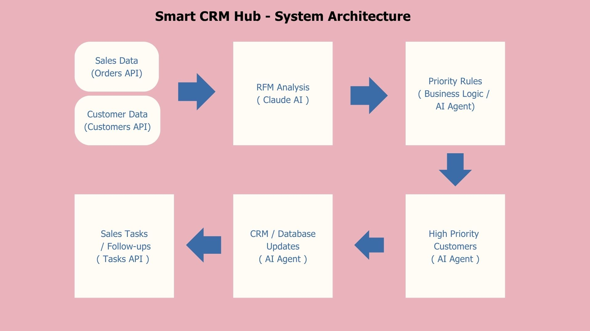
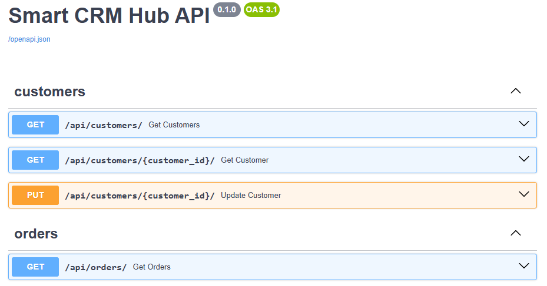
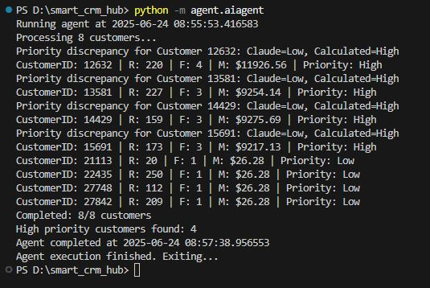

# AI Agent for RFM Analysis - Hands-on Lab

[](https://opensource.org/licenses/MIT)
[](https://www.python.org/downloads/)
[](https://nodejs.org/)
[](https://azure.microsoft.com/)

## Table of Contents
- [✨ Key Features](#key-features)
- [📋 What You'll Learn](#what-youll-learn)
- [🛠 Tech Stack](#tech-stack)
- [🚀 Quick Start](#quick-start)
- [⚙️ FastAPI Setup](#fastapi-setup)
- [🤖 AI Agent Setup](#ai-agent-setup)
- [📊 Understanding RFM Analysis](#understanding-rfm-analysis)
- [🐛 Troubleshooting](#troubleshooting)
- [📈 Next Steps](#next-steps)
- [🤝 Contributing](#contributing)


**🎯 Goal:** Build an intelligent AI Agent that performs automated RFM (Recency, Frequency, Monetary) analysis on customer data, identifies high-value prospects, and creates targeted follow-up tasks using Claude AI and Azure infrastructure.



---

<a id="key-features"></a>
## ✨ Key Features

* Automated **RFM analysis** on customer data.
* **High-value prospect identification** using Claude AI.
* **Targeted sales task creation** based on AI insights.
* Seamless integration with **Azure SQL Database** and **FastAPI**.
* **Automated Azure infrastructure deployment** with PowerShell.
---

<a id="what-youll-learn"></a>
## 📋 What You'll Learn

- Deploy Azure infrastructure using PowerShell automation
- Build a FastAPI service connected to Azure SQL Database  
- Implement an AI Agent using Claude AI for customer analysis
- Perform RFM analysis to segment customers by value
- Automate sales task creation based on AI insights

<a id="tech-stack"></a>
## 🛠 Tech Stack

| Technology | Version | Purpose |
|------------|---------|---------|
| **Python** | 3.12.6+ | Backend API and AI Agent |
| **Node.js** | 18.20.5+ | Development tooling |
| **FastAPI** | Latest | REST API service |
| **Azure SQL Database** | - | Data storage |
| **Claude AI** | - | Customer analysis engine |
| **Azure Key Vault** | - | Secret management |

Note: I am running a Windows 11 system.


### Required Tools

- [Python 3.12.6+](https://www.python.org/downloads/)
- [Node.js 18.20.5+](https://nodejs.org/en/download)
- [VS Code](https://code.visualstudio.com/) with extensions:
  - Python
  - SQL Server (mssql)
- [Azure Account](https://azure.microsoft.com/en-us/pricing/purchase-options/azure-account/) (free tier available)
- [Claude API Key](https://console.anthropic.com/settings/keys) ($5 minimum credit purchase)

---

<a id="quick-start"></a>
## 🚀 Quick Start

### 1. Initial Setup

```bash
# Clone the repository
git clone https://github.com/darthsamples/smart-crm-hub.git
cd smart_crm_hub
code .
```
### 2. Deploy Azure Infrastructure
Before running the below script, update $TenanID, $myIpStart, and $myIpEnd variables
```
.\_PowerShell_Resources\azure_resources_deployment.ps1
```
⚠️ Important: Save the output values - you will need them for the .env file.

### 3. Environment Configuration
Create the .env file in your project root with the previously copied values:

    # Azure Configuration
    AZURE_RESOURCE_GROUP_NAME="your-resource-group-name"
    AZURE_KEY_VAULT_NAME="your-key-vault-name"
    AZURE_SERVICE_PRINCIPAL_CLIENT_ID="your-client-id"
    AZURE_SERVICE_PRINCIPAL_CLIENT_SECRET="your-client-secret"
    AZURE_SUBSCRIPTION_ID="your-subscription-id"
    AZURE_TENANT_ID="your-tenant-id"

    # Database Configuration
    SQL_SERVER_NAME="your-server.database.windows.net"
    SQL_DATABASE_NAME="your-database-name"
    SQL_USERNAME="your-username"
    SQL_PASSWORD="your-password"

    # AI Configuration
    CLAUDE_API_KEY="your-claude-api-key"
---

<a id="fastapi-setup"></a>
## ⚙️ FastAPI Setup

### 1. Verify Azure Resources
1. Log in to the [Azure Portal](https://portal.azure.com/).
2. Confirm these resources exist:
    ✅ Resource Group
    ✅ Service Principal
    ✅ Key Vault with secrets
    ✅ Azure SQL Database

### 2. Install Dependencies
```bash
    pip install -r .\requirements.txt
```

### 3. Database Schema Setup
Connect to your Azure SQL Database and run these scripts:

```sql
-- Create LeadTasks table for AI-generated follow-ups
CREATE TABLE Sales.LeadTasks (
    TaskId INT IDENTITY(1,1) NOT NULL PRIMARY KEY,
    CustomerID INT REFERENCES Sales.Customer(CustomerID) NOT NULL,
    TaskDescription TEXT NOT NULL,
    AssignedTo TEXT NOT NULL,
    DueDate DATE NOT NULL
);

-- Add LeadStatus column to Customer table
ALTER TABLE [Sales].[Customer] ADD [LeadStatus] VARCHAR(MAX) NULL;

-- TESTING ONLY: Adding 11 years to refresh outdated sales data 
BEGIN TRAN 
UPDATE Sales.SalesOrderHeader 
SET OrderDate = DATEADD(year, 11, OrderDate) ,
	DueDate = DATEADD(year, 11, DueDate),
	ShipDate = DATEADD(year, 11, ShipDate)
COMMIT TRAN

```

### 4. Start the FastAPI Server
```bash
# Create and activate virtual environment
python -m venv venv
.\venv\Scripts\activate

# Install FastAPI dependencies
pip install fastapi uvicorn pyodbc python-dotenv azure-identity azure-keyvault-secrets

# Start the server
uvicorn app.main:app --reload
```

### 5. Test API Endpoints
Visit [http://127.0.0.1:8000/docs](http://127.0.0.1:8000/docs)

| Endpoint | Expected Result | Test Data |
|------------|---------|---------|
| GET /customers | Returns 8 customers | - |
| GET /customers/{id} | Single customer | CustomerID: 27842 |
| GET /orders | Returns 17 orders | - |
| GET /orders/customer/{id} | Customer orders | CustomerID: 27842 | 
| GET /tasks | Empty array [] | - |
| GET /reports | leads: 0, tasks: 0 | - |


---

<a id="ai-agent-setup"></a>
## 🤖 AI Agent Setup

### Architecture Overview
 Component | Description |
| ----------- | ----------- |
| **config.py** | Configuration for Claude AI and FastAPI endpoints |
| **utils.py** | API request utilities and RFM parsing functions |
| **agent.py** | Main AI Agent for customer analysis and task creation |

### Prerequisites
1. **Claude API Key**: Get from [Anthropic console](https://console.anthropic.com/settings/keys)
2. **Credits**: Minimum $5 purchase (each run costs ~$0.02-0.03)

## Running the AI Agent
```
# Install Anthropic library
pip install anthropic

# Execute the AI Agent
python -m agent.aiagent
```

## Expected Results



After successful completion:
* GET /customers/{14429} → Shows updated LeadStatus
* GET /tasks → Returns 4 follow-up tasks
* GET /reports → Shows leads: 4, tasks: 4
---

<a id="understanding-rfm-analysis"></a>
## 📊 Understanding RFM Analysis
**RFM** segments customers based on:
* 📅 Recency: How recently did they purchase?
* 🔄 Frequency: How often do they purchase?
* 💰 Monetary: How much do they spend?

The AI Agent automatically:

1. Analyzes customer purchase patterns
2. Scores customers on RFM metrics
3. Identifies high-value prospects
4. Creates personalized follow-up tasks
---
### 🔍 Sample Customer Analysis
For demonstration, the lab focuses on 8 specific customers. To find additional high-value customers:
```sql
SELECT DISTINCT CustomerID, SUM(totalDue) AS TotalAmount
FROM Sales.SalesOrderHeader
WHERE CustomerID IN (
    SELECT DISTINCT CustomerID
    FROM Sales.Customer WHERE StoreID IS NULL
)
GROUP BY CustomerID
ORDER BY TotalAmount DESC;
```
**Demo Customer IDs:** 12632, 13581, 14429, 15691, 27842, 22435, 27748, 21113
---

<a id="troubleshooting"></a>
## 🐛 Troubleshooting
## Common Issues
| Issue | Solution |
|-------|----------|
| PowerShell execution policy | Run ```powershell Set-ExecutionPolicy -ExecutionPolicy RemoteSigned -Scope CurrentUser``` |
| Database connection failed | Verify firewall rules allow your IP in Azure SQL |
| FastAPI not starting | Check if port 8000 is available |
| Claude API errors | Verify API key and credit balance |
| Missing environment variables | Double-check .env file configuration |

## Debug Steps
1. **Test database connectivity** using VS Code SQL extension
2. **Verify Azure resources** in Azure Portal
3. **Check FastAPI logs** for detailed error messages
4. **Validate API responses** using the /docs endpoint
---

<a id="next-steps"></a>
## 📈 Next Steps
After completing this lab, consider:

* **Scaling**: Analyze larger customer datasets
* **Automation**: Schedule regular RFM analysis
* **Integration**: Connect with CRM systems
* **Advanced AI**: Implement predictive modeling
* **Visualization**: Add dashboards for RFM insights
* **Tokens economy**: Analyze and identify opportunities to reduce the number of tokens used.
---

<a id="contributing"></a>
## 🤝 Contributing
Contributions are welcome, so please:
1. Fork the repository
2. Create a feature branch (git checkout -b feature/amazing-feature)
3. Commit your changes (git commit -m 'Add amazing feature')
4. Push to the branch (git push origin feature/amazing-feature)
5. Open a Pull Request

## Development Guidelines
* Follow PEP 8 for Python code
* Add tests for new features
* Update documentation as needed
* Test with the provided sample data
---

### 🙏 Acknowledgments
* **Anthropic** for Claude AI capabilities
* **Microsoft Azure** for cloud infrastructure
* **FastAPI** for the excellent API framework
* **Community contributors** for testing and feedback

